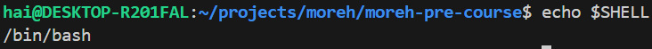
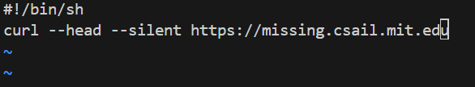
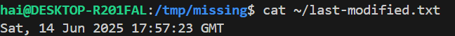
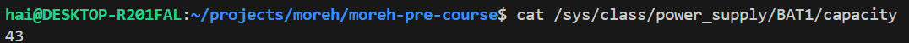

## Part 1: Course overview + the shell
### 1. For this course, you need to be using a Unix shell like Bash or ZSH. If you are on Linux or macOS, you don’t have to do anything special. If you are on Windows, you need to make sure you are not running cmd.exe or PowerShell; you can use Windows Subsystem for Linux or a Linux virtual machine to use Unix-style command-line tools. To make sure you’re running an appropriate shell, you can try the command `echo $SHELL`. If it says something like `/bin/bash` or `/usr/bin/zsh`, that means you’re running the right program.



### 2. Create a new directory called `missing` under `/tmp`.

```bash
mkdir /tmp/missing
```

### 3. Look up the `touch` program. The `man` program is your friend.

```bash
man touch
```


### 4. Use touch to create a new file called 
`semester` in `missing`

```bash
touch /tmp/missing/semester
```

### 5. Write the following into that file, one line at a time:

```
#!/bin/sh
curl --head --silent https://missing.csail.mit.edu
```



### 6. Try to execute the file, i.e. type the path to the script (`./semester`) into your shell and press enter. Understand why it doesn’t work by consulting the output of `ls` (hint: look at the permission bits of the file)

The file doesn't have execution permission.


### 7. Run the command by explicitly starting the `sh` interpreter, and giving it the file `semester` as the first argument, i.e. `sh semester`. Why does this work, while `./semester` didn’t?

Invoking the shell explicitly (`sh semester`) cause the shell to read and interpret the file's content.

However, when trying to execute the file directly (`./semester`), the system check for the file's execution permission first. It doesn't have the required permission so the command fails.

### 8. Look up the `chmod` program (e.g. use `man chmod`)

```bash
man chmod
```


### 9. Use chmod to make it possible to run the command `./semester` rather than having to type `sh semester`. How does your shell know that the file is supposed to be interpreted using `sh`?

```bash
sudo chmod +x /tmp/missing/semester
```

The shebang (`#!`) tells the shell which interpreter to use (in this case it's `/bin/sh`).

### 10. Use `|` and `>` to write the “last modified” date output by `semester` into a file called `last-modified.txt` in your home directory

```bash
./semester | grep last-modified | cut -d ' ' -f 2- > ~/last-modified.txt
```



### 11. Write a command that reads out your laptop battery’s power level or your desktop machine’s CPU temperature from `/sys`. Note: if you’re a macOS user, your OS doesn’t have sysfs, so you can skip this exercise.

Command to read my laptop battery's power level:

```bash
cat /sys/class/power_supply/BAT1/capacity
```




