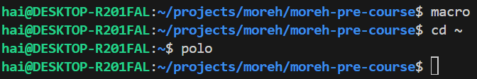
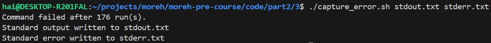

## Part 2: Shell Tools and Scripting
### 1. Read `man ls` and write an `ls` command that lists files in the following manner
- Includes all files, including hidden files
- Sizes are listed in human readable format (e.g. 454M instead of 454279954)
- Files are ordered by recency
- Output is colorized

```bash
ls -laht --color=always
```


### 2. Write bash functions `marco` and `polo` that do the following. Whenever you execute `marco` the current working directory should be saved in some manner, then when you execute `polo`, no matter what directory you are in, `polo` should `cd` you back to the directory where you executed `marco`. For ease of debugging you can write the code in a file `marco.sh` and (re)load the definitions to your shell by executing source `marco.sh`.

See [marco.sh](../code/part2/2/marco.sh).



### 3. Say you have a command that fails rarely. In order to debug it you need to capture its output but it can be time consuming to get a failure run. Write a bash script that runs the following script until it fails and captures its standard output and error streams to files and prints everything at the end. Bonus points if you can also report how many runs it took for the script to fail.

See [capture_error.sh](../code/part2/3/capture_error.sh).



### 4. Your task is to write a command that recursively finds all HTML files in the folder and makes a zip with them. Note that your command should work even if the files have spaces

```bash
find . -type f -name "*.html" -print0 | xargs -0 zip html_files.zip
```

### 5. Write a command or script to recursively find the most recently modified file in a directory. More generally, can you list all files by recency?

Command to list all files in current directory by recency

```bash
find . -type f -exec stat --format '%Y %n' {} + | sort -nr | cut -d ' ' -f 2
```

To find the most recently modified file, simply take the first file of the list

```bash
find . -type f -exec stat --format '%Y %n' {} + | sort -nr | cut -d ' ' -f 2 | head -n 1
```