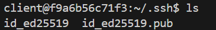
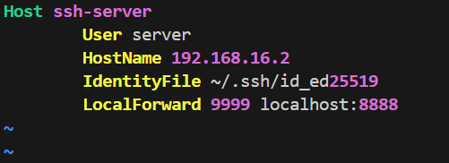

## Part 3: Command-line Environment

### Prerequisites

You need to [setup your environment](../code/part3/README.md) to do these exercises.

### 1. Go to `~/.ssh/` and check if you have a pair of SSH keys there. If not, generate them with `ssh-keygen -a 100 -t ed25519`


### 2. Edit `.ssh/config` to have an entry as follows
```file
Host vm
    User username_goes_here
    HostName ip_goes_here
    IdentityFile ~/.ssh/id_ed25519
    LocalForward 9999 localhost:8888
```

To find the ip address of `ssh-server`, run the following command:

```bash
docker inspect ssh-server | grep IPAddress
```

The resulting config file



### 6. Install `mosh` in the VM and establish a connection. Then disconnect the network adapter of the server/VM. Can mosh properly recover from it?

- Install mosh on both the client and server

```bash
# Inside the container
sudo apt update && sudo apt-get install -y mosh
```

- Establish an ssh connection from client to server

```bash
# Inside client container
LC_ALL="C.UTF-8" mosh ssh-server
```

**`LC_ALL="C.UTF-8"` is required because mosh-server needs a UTF-8 native locale to run**

- In another (host) terminal, disconnect server from the network
```bash
docker network disconnect part3_ssh-net ssh-server
```

- Observe in the client terminal the SSH session is not terminated


- Reconnect server to the network
```bash
docker network connect part3_ssh-net ssh-server
```

- `mosh` correctly recover from the disconnect


### 7. Look into what the `-N` and `-f` flags do in ssh and figure out a command to achieve background port forwarding.
- `-N`: Do not execute any command in remote machine
- `-f`: Make `ssh` go to background

Combined together, we can use these flags to make ssh only purpose is to forward `[local-port]` to `[remote-port]` in the background.

```bash
ssh -N -f -L [local-port]:localhost:[remote-port] [remote-server] 
``` 

For example, to forward remote port `456` to local port `123`

```bash
ssh -N -f -L 123:localhost:456 ssh-server
```