## Part 4: Debugging and Profiling
### 1. Use `journalctl` on Linux or `log show` on macOS to get the super user accesses and commands in the last day. If there aren’t any you can execute some harmless commands such as sudo ls and check again.


### 2. Do this hands on pdb tutorial to familiarize yourself with the commands.

To get the tutorial:
```bash
git submodule update --init --recursive
```

The following fixes have been applied:

1. Correctly add the value of the dies

```diff
# runner.py
@@ -15,7 +14,7 @@ class GameRunner:
     def answer(self):
         total = 0
         for die in self.dice:
-            total += 1
+            total += die.value
         return total
```
2. Correctly handle quitting the game

```diff
# runner.py
@@ -52,9 +51,9 @@ class GameRunner:
                 print("The fact it took you so long is pretty sad")
                 break
 
-            prompt = input("Would you like to play again?[Y/n]: ")
+            prompt = input("Would you like to play again?[Y/n]: ").lower()
 
             if prompt == 'y' or prompt == '':
                 continue
             else:
-                i_just_throw_an_exception()
+                break
```

3. Remove unnecessary import

```diff
# runner.py
@@ -1,5 +1,4 @@
 from .die import Die
-from .utils import i_just_throw_an_exception
 
 class GameRunner:
```

### 3. Install `shellcheck` and try checking the following script. What is wrong with the code? Fix it. Install a linter plugin in your editor so you can get your warnings automatically.

Original script:

```bash
#!/bin/sh
## Example: a typical script with several problems
for f in $(ls *.m3u)
do
  grep -qi hq.*mp3 $f \
    && echo -e 'Playlist $f contains a HQ file in mp3 format'
done
```

Fixed script:

```bash
#!/bin/bash
for f in *.m3u  # Use glob instead of ls output
do
  grep -qi "hq.*mp3" "$f" \  # Quote the grep pattern so the shell won't interpret it
    && printf "Playlist %s contains a HQ file in mp3 format" "$f"  # Use printf instead of echo with flags and double quote to expand variable expression
done
```

### 4. Read about reversible debugging and get a simple example working using `rr` or `RevPDB`.

This example is based on [this demo](https://www.youtube.com/watch?v=61kD3x4Pu8I) from the `rr` project.

1. Build and install `rr` from source based on [this guide](https://github.com/rr-debugger/rr/wiki/Building-And-Installing). You can also clone the repo using git submodule.
```bash
git submodule update --init --recursive
```

2. Record the `barrier` binary
```bash
cd code/part4
rr record ./obj/bin/barrier
```


*Note: You may need to run `sudo sysctl kernel.perf_event_paranoid=1` for `rr record` to work*

3. Replay the recording
```bash
rr replay
```


4. Observer that the result is the same as the recording


### 5. Here are some sorting algorithm implementations. Use `cProfile` and `line_profiler` to compare the runtime of insertion sort and quicksort. What is the bottleneck of each algorithm? Use then `memory_profiler` to check the memory consumption, why is insertion sort better? Check now the inplace version of quicksort. Challenge: Use `perf` to look at the cycle counts and cache hits and misses of each algorithm.

#### 1. CPU Profiling

- Using `cProfile`:
```bash
python -m cProfile -s tottime sorts.py
```


- Using `line_profiler`:
```bash
kernprof -l -v sorts_cpu_line_profile.py
```

Insertion Sort:

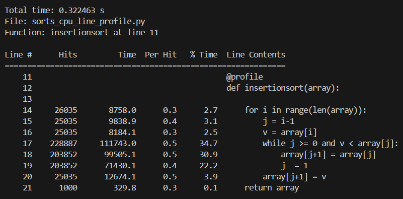

Quicksort:

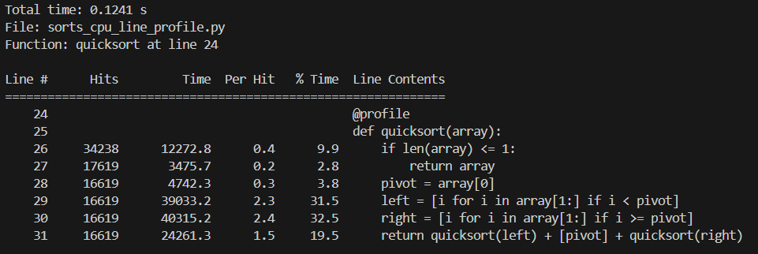

Quicksort inplace:

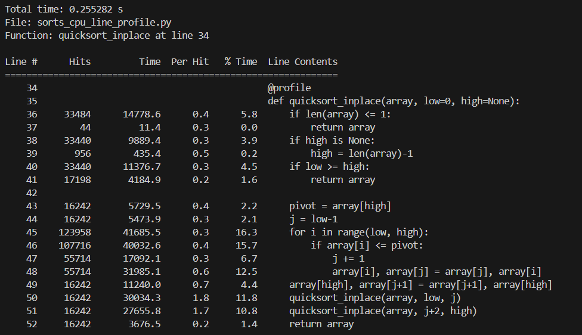

**Conclusion:**
- The runtime of quicksort (both version) is faster than insertion sort. This is consistent with the theoretical average performance of both algorithms (`O(n²)` for insertion sort and `O(nlogn)` for quicksort).
- Insertion sort spends most of its time on the while loop in line 17, which performs the insertion operation
- Quicksort (both version) spends most of its time on the partition operation, which split the array into 2 parts corresponding to their order compared to `pivot`.

#### 2. Memory profiling

For observable and consistent behavior, the following changes are made to the original script:

- The test array is allocated only once. This ensures all algorithms run with same size input
- The size of test array is increased to 10000 elements so that the impact of new allocation is more visible
- Since insertion sort takes quadratic time to finish and the array size is quite large, each algorithm is run only once. We want to profile the `test_sorted` function to compare the memory usage before and after running each algorithm.

To run the script:
```bash
python -m memory_profiler sorts_mem_profiler.py
```

Results:

Quicksort:

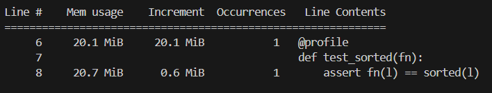

Quicksort inplace:

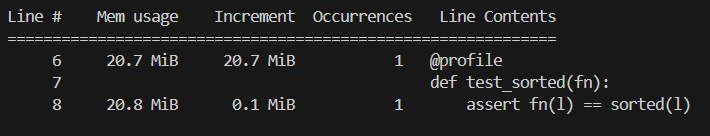

Insertion Sort:

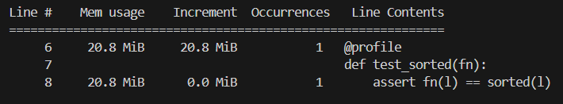

**Conclusion:**
- Quicksort uses the most memory due to allocating new arrays (`left`, `right` and the returning array)
- Quicksort inplace uses less memory than Quicksort, but still has significant overhead (`0.1 MiB`). This is probably due to the recursive implementation of this function, which grows the call stack hence increases memory usage.
- Insertion Sort does not comsume extra memory because it does not allocate new objects and uses an iterative approach.

#### 3. Profiling with `perf`

If you are using WSL, follow [this Stackoverflow answer](https://stackoverflow.com/a/65276025) to run `perf`

```bash
/usr/lib/linux-tools/<linux-version>-generic/perf stat -e cycles,instructions,cache-references,cache-misses python sorts_perf.py [ALGORITHM]
```

Otherwise, just use the `perf` command normally.

```bash
perf stat -e cycles,instructions,cache-references,cache-misses python sorts_perf.py [ALGORITHM]
```

where `ALGORITHM` can be `quicksort`, `quicksort_inplace` or `insertionsort`.

Results:

Insertion Sort:

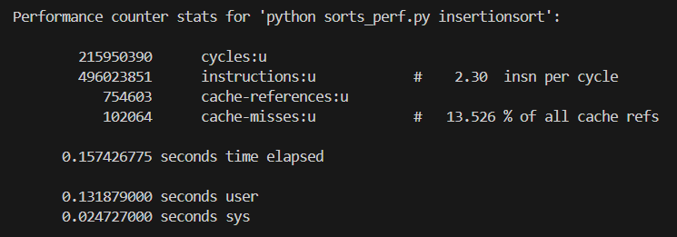

Quicksort:

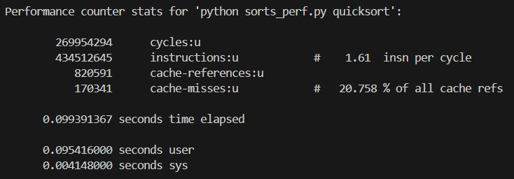

Quicksort inplace:

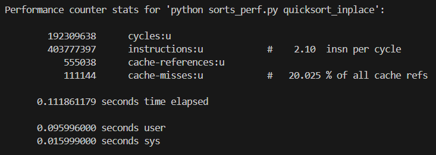

### 6. Put the code into a file and make it executable. Install prerequisites: `pycallgraph` and `graphviz`. (If you can run `dot`, you already have `GraphViz`.) Run the code as is with `pycallgraph graphviz -- ./fib.py` and check the `pycallgraph.png` file. How many times is `fib0` called?. We can do better than that by memoizing the functions. Uncomment the commented lines and regenerate the images. How many times are we calling each `fibN` function now?


Based on the resulting image, `fib0` is called 21 times.

!

When using memoization, each `fibN` function is only called once because they have been cached.

### 7. A common issue is that a port you want to listen on is already taken by another process. Let’s learn how to discover that process pid. First execute `python -m http.server 4444` to start a minimal web server listening on port `4444`. On a separate terminal run `lsof | grep LISTEN` to print all listening processes and ports. Find that process pid and terminate it by running `kill <PID>`

1. Starting HTTP server on port `4444`

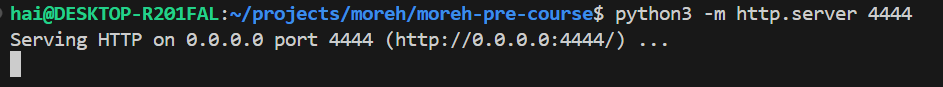

2. Run `lsof | grep LISTEN`

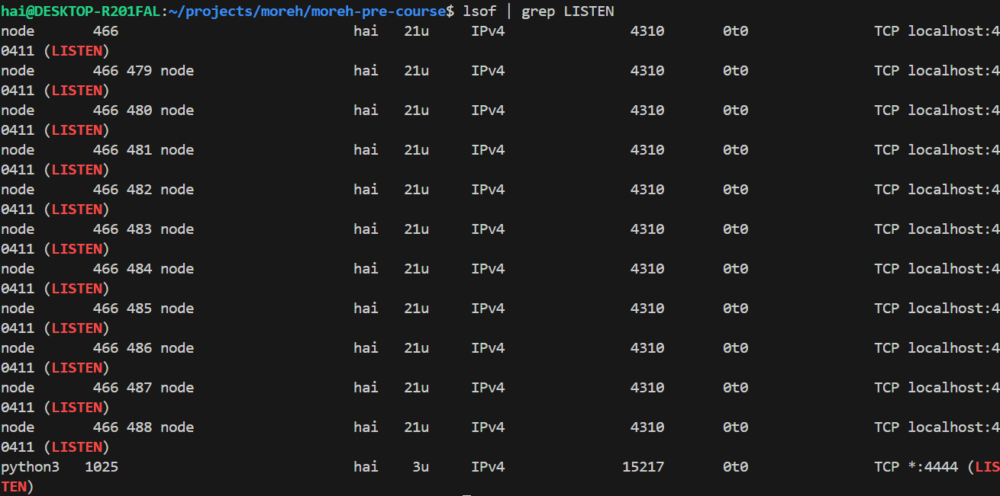

3. Kill server process

```bash
kill 1025
```

### 8. Limiting a process’s resources can be another handy tool in your toolbox. Try running `stress -c 3` and visualize the CPU consumption with `htop`. Now, execute `taskset --cpu-list 0,2 stress -c 3` and visualize it. Is `stress` taking three CPUs? Why not? Read `man taskset`. Challenge: achieve the same using `cgroups`. Try limiting the memory consumption of `stress -m`.

#### 1. Running `stress -c 3`

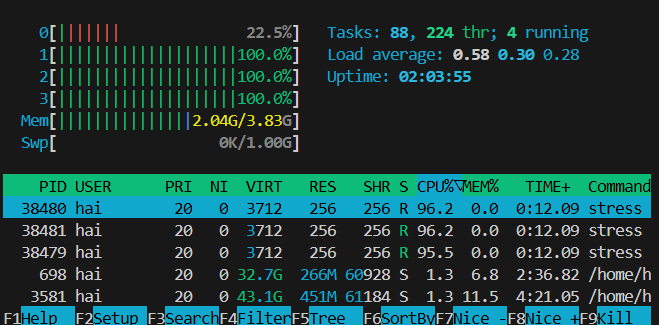

This command takes up 3 CPUs.

#### 2. Running `taskset --cpu-list 0,2 stress -c 3`

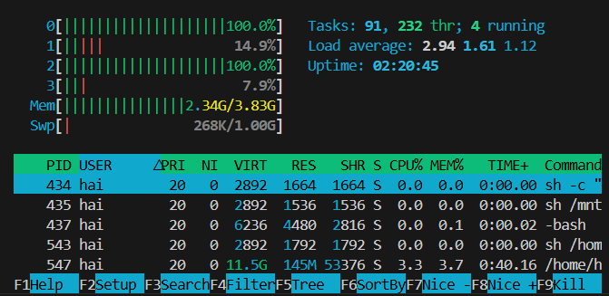

This command only takes up 2 CPUs.

`taskset` set a process's CPU affinity, in other words it would not run on any other CPUs than the ones specify by `taskset`. Because we only set 2 CPUs in `cpu-list`, this process runs on these 2 CPUs (`0` and `2`). Therefore, `stress` can only use up at most 2 CPUs.

#### 3. Using `cgroup`

1. Enable the `cpuset` controller for `cgroup`:
```bash
echo "+cpuset" | sudo tee /sys/fs/cgroup/cgroup.subtree_control
```

2. Create a `cgroup` named `mygroup`:

```bash
sudo mkdir /sys/fs/cgroup/mygroup
```

3. Limit `mygroup` to only use 1 CPU (which is equivalent to using up 3 CPUs with `stress` because my machine has 4 CPUs).

```bash
echo 0 | sudo tee /sys/fs/cgroup/mygroup/cpuset.cpus
```

4. Add current process to cgroup:

```bash
echo $$ | sudo tee /sys/fs/cgroup/mygroup/cgroup.procs
```

5. Check that the current process only uses CPU 0:

```bash
taskset -cp $$
```

#### 4. Limiting memory consumption

Before limiting memory consumption:

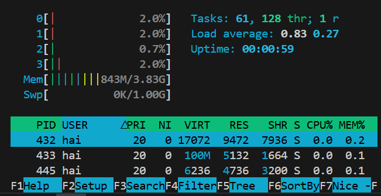

Running `stress` on memory usage

```bash
stress --vm 1 --vm-bytes 2G
```

After limiting memory consumption:

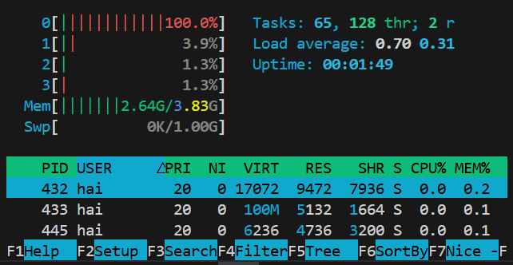

