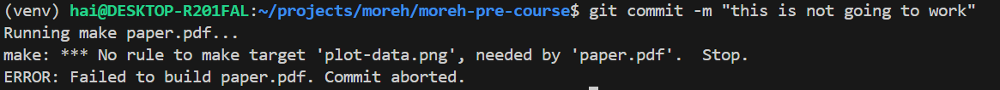

## Part 5: Metaprogramming
### 1. Most makefiles provide a target called `clean`. This isn’t intended to produce a file called `clean`, but instead to clean up any files that can be re-built by make. Think of it as a way to “undo” all of the build steps. Implement a `clean` target for the `paper.pdf` `Makefile` above. You will have to make the target phony. You may find the `git ls-files` subcommand useful.

See [the modified Makefile](../code/part5/Makefile).

To use it:
```bash
make clean
```

It would remove any files generated from the `make` command.

### 2. Take a look at the various ways to specify version requirements for dependencies in Rust’s build system. Most package repositories support similar syntax. For each one (caret, tilde, wildcard, comparison, and multiple), try to come up with a use-case in which that particular kind of requirement makes sense.

Rust's version requirements specification follows Semantic Versioning. From [their website](https://semver.org/)

> Given a version number MAJOR.MINOR.PATCH, increment the:
>
> MAJOR version when you make incompatible API changes
>
> MINOR version when you add functionality in a backward compatible manner
>
> PATCH version when you make backward compatible bug fixes
>
> Additional labels for pre-release and build metadata are available as extensions to the MAJOR.MINOR.PATCH format.

- Caret (`^`)
  * Allows updates that do not modify major version (the leftmost non-zero digit)
  * Usecase: When you trust the minor version update do not introduce any breaking changes (adhering to Semantic Versioning), it allows others to update this dependency to newer version for enhancement features.
- Tilde (`~`)
  * Similar to caret, it specifies the minimal compatible version. However, you can also fix the minor version.
  * Usecase: You want stricter control on your dependencies than using caret
- Wildcard (`*`)
  * Allow for any version where the wildcard is positioned
  * Usecase: When versioning doesn't matter (experimentation, simple script, etc), you just replace them with wildcards
- Comparison (`<=>`)
  * Manually specifying the compatible version range
  * Usecase: When you need fine-grained control over versions, for example when a dependency stops supporting your current environment.
- Multiple:
  * Combining multiple version requirements with a comma separated list
  * Usecase: When you want to avoid known bad versions

### 3. Git can act as a simple CI system all by itself. In `.git/hooks` inside any git repository, you will find (currently inactive) files that are run as scripts when a particular action happens. Write a `pre-commit` hook that runs `make paper.pdf` and refuses the commit if the make command fails. This should prevent any commit from having an unbuildable version of the paper.

See [the pre-commit hook file](../.githooks/pre-commit)

To apply it to your repo
```bash
git config core.hooksPath .githooks
```

Trying to rename `data.dat` to `data2.dat` and make a commit would result in a rejection



### 4. Set up a simple auto-published page using `GitHub Pages`. Add a `GitHub Action` to the repository to run `shellcheck` on any shell files in that repository (here is one way to do it). Check that it works!

Visit the page at [this link](https://anhaitrinh.github.io/moreh-pre-course/).

[This action](../.github/workflows/lint_shell.yml) run shellcheck to all shell files in the repo

### 5. Build your own GitHub action to run `proselint` or `write-good` on all the `.md` files in the repository. Enable it in your repository, and check that it works by filing a pull request with a typo in it

See [here](../.github/actions/markdown-lint/) for a custom Github action using `proselint`

This action is used to spell check this repo in [this workflow](../.github/workflows/lint_md.yml)